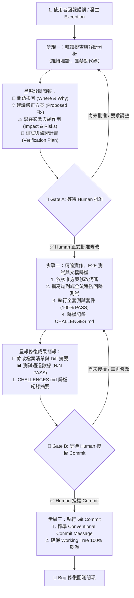

> ## [DEPRECATED] 本 Skill 已遷移
>
> **現行版本：`.claude/skills/bug-fix-protocol/SKILL.md`**
>
> **本路徑（`.agents/skills/`）不會被 Claude Code 載入**，因此本檔實際上並未生效。
> 本檔保留為歷史錨點，內文未更新，**不得作為現行 SOP 依據**。
>
> 既有文件中指向本路徑的引用，改寫作業排入 `UG-G1-SB5`。
> **建立依據**：GOV-01 治理層例外授權，2026-08-23。

---

# Interactive Bug Fix Protocol (Human-in-the-Loop 除錯標準作業流程)

本 Skill 定義所有錯誤排查、Bug 修復與異常診斷的**絕對紀律與標準作業程序（SOP）**。  
核心目標：**杜絕未經溝通的擅自修改、杜絕隱蔽副作用（Side Effects），並確保每一次修復都有端到端全流程測試、文檔歸檔與授權閉環。**

---

## 1. 核心不可違反原則 (Strict Invariants)

1. **先診斷回報，絕對不私自改代碼 (Report First, Never Code Without Approval)**：
   - 當使用者回報錯誤、提供 Traceback 或要求找問題時，**第一階段僅能執行讀取與診斷（Read-Only Investigation）**。
   - **在未取得 Project Owner (Human) 明確批准前，嚴禁使用任何檔案編輯或寫入工具！**
2. **完整影響與風險評估 (Impact & Regression Analysis)**：
   - 診斷報告必須清楚說明「為什麼會錯」、「預計怎麼改」、「可能影響到哪些模組/資料表」，以及「是否有潛在副作用」。
3. **兩階段人機確認點 (Two-Gate Human Verification)**：
   - **Gate A (修改准許)**：只有 Human 回覆「准許修改」或同意修正方案後，才能動手改代碼。
   - **Gate B (Commit 授權)**：修改與測試完成後，必須回報差異清單與測試結果；**只有 Human 明確指示「同意 Commit」後，才能執行 Git Commit！**
4. **端到端全流程防回歸測試（End-to-End Flow Safety Net）**：
   - 除了局部單元測試外，**必須撰寫涵蓋上下游全流程的整合防回歸測試（E2E Regression Test）**，模擬「輸入 ➔ 異常復原 ➔ 下游聚合 ➔ 資料庫寫入」全鏈路，徹底防範「修好 A 卻破壞 B」。全套測試必須 100% PASS。
5. **非瑣碎問題強制歸檔（Mandatory Challenge Documentation）**：
   - 凡涉及架構彈性（Resilience）、限速（Rate Limit）、快取（Cache）、並發或資料契約（Data Contract）等非單純拼寫錯誤的 Bug，**修復完成後必須正式歸檔記錄於 `doc/evidence/CHALLENGES.md`**，留下高價值的作品集工程證據。

---

## 2. 四步驟標準作業流程 (Standard 4-Step Workflow)

---

### 步驟一：診斷與影響分析回報 (Diagnosis & Impact Assessment)
**【執行約束】：維持唯讀狀態（Read-Only），嚴禁修改任何檔案！**

1. 檢視 Traceback、日誌與相關原始程式碼，精準定位根因。
2. 評估資料流與上下游依賴（如：資料庫欄位、API 契約、前後端介面）。
3. 向使用者呈報「**Bug 診斷與修正建議簡報**」，格式如下：
   - 📍 **【問題定位與根因】**：出現在哪個檔案、哪一行、觸發錯誤的精確條件。
   - 💡 **【預計修正方案】**：預計如何修改、是否有替代方案及其 Trade-off。
   - ⚠️ **【潛在影響與副作用評估】**：修改是否會影響其他模組、資料庫綱要或現有測試。
   - 🧪 **【測試與驗證計畫】**：預計新增什麼端到端測試案例來驗證修復。
4. **🛑 停止動作，等待 Human 審查並回覆指示。**

---

### 步驟二：核准後實作、測試與文檔歸檔 (Implementation, E2E Test & Challenge Doc)
**【執行約束】：只有在 Human 明確批准後方可執行！**

1. 嚴格依照核准的方案進行小範圍精確修改。
2. 撰寫**端到端全流程防回歸測試（E2E Regression Test）**，驗證上下游全流程連鎖反應。
3. 執行全套測試套件，確保無任何意外破壞（100% PASS）。
4. 若為非瑣碎技術難題，將問題現象、根因、解法與驗證同步記錄至 `doc/evidence/CHALLENGES.md`。

---

### 步驟三：成果回報與請求 Commit 授權 (Results Report & Authorization Request)
**【執行約束】：嚴禁在此階段擅自執行 Git Commit！**

1. 向使用者呈報「**Bug 修復與測試驗證報告**」，包含：
   - 📝 **【修改檔案與變更摘要】**：列出所有修改的檔案與主要變更。
   - 📊 **【測試驗證結果】**：報告專項測試與全套測試通過數據（例：`136/136 PASS`）。
   - 📌 **【工程挑戰歸檔紀錄】**：說明 `CHALLENGES.md` 新增之 Challenge 編號與亮點。
2. **🛑 停止動作，明確向 Human 請求 Git Commit 授權。**

---

### 步驟四：授權後提交 (Commit upon Explicit Consent)
**【執行約束】：只有在 Human 明確回覆授權後方可執行！**

1. 依照 Conventional Commits 規範執行 Commit（例：`fix(nlp): implement exponential backoff retry for gemini 429 rate limit`）。
2. 檢查 `git status`，確認 working tree 乾淨無殘留。
3. 向 Human 回報 Commit 完成與後續指引。

---

## 3. 使用範例 (How to Trigger)

當使用者在對話中提及：
- 「我執行 ... 出錯了」
- 「幫我找問題 / 修 Bug」
- 「這段代碼好像有問題」
- 或任何運行時 Exception

Agent 必須**立即主動啟動本 Skill**，嚴格依循 `診斷回報 ➔ 等待批准 ➔ 實作與E2E測試 ➔ 歸檔挑戰 ➔ 回報成果 ➔ 等待授權 ➔ 執行 Commit` 流程前進！
