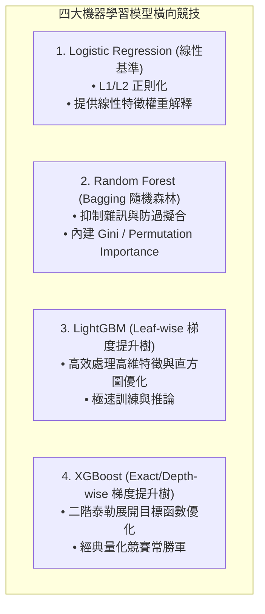
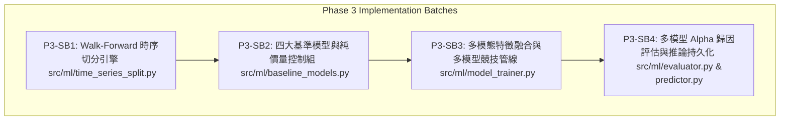

# PHASE3_ML_PLAN.md — Phase 3 機器學習多模型對比與滾動驗證實作計畫書

> **文件使命**：本文件為 Phase 3 機器學習多模型橫向競技（Multi-Model Tournament）、特徵融合與滾動驗證之架構設計與小批次實作藍圖。
> 嚴格遵循 `doc/PRD_Financial_Sentiment_System_v1.md` 與 `AGENTS.md` 之工程紀律，在 Project Owner (Human) 正式審核通過前，**維持唯讀狀態，嚴禁修改或建立任何 Phase 3 業務程式碼**。

---

## 1. Phase 3 使命與多模型橫向競技體系 (Mission & Multi-Model Tournament)

### 1.1 核心使命
在 Gate 4（雙模式時間對齊與零前視偏誤防護）與 Gate 5（18 欄位機構級特徵契約）所建立的堅實基石之上，Phase 3 的核心目標在於：
1. **構建嚴格的金融時序交叉驗證引擎**：以 **Walk-Forward Cross Validation（滾動前向驗證）** 模擬真實投資場景，杜絕任何未來資料洩漏。
2. **多模型橫向競技（Multi-Model Tournament）**：依據 PRD 規格，全面納入 **Logistic Regression、Random Forest、LightGBM、XGBoost** 四大經典與樹狀模型進行橫向對比。
3. **量化驗證社群情緒之超額預測力（Alpha Contribution）**：透過 4 種演算法 $\times$ 2 組特徵集（純價量 vs 融合情緒）共 **8 組平行對照實驗**，嚴謹證明社群情緒特徵在不同演算法下的穩定性與超額報酬貢獻。
4. **產出輕量化且高可解釋性的預測引擎**：選出最佳模型（Champion Model），支援每日盤後即時推論，為 Phase 4 BI 視覺化儀表板提供核心數據輸出。

### 1.2 多模型橫向對比架構 (Multi-Model Architecture Matrix)

為全面落實 PRD 之規劃，Phase 3 實作統一的模型介面（Unified Model Interface），納入四種具備互補特性的機器學習演算法：



| 模型名稱 (Algorithm) | 模型類型 (Family) | 在本系統之角色與核心優勢 |
|---|---|---|
| **Logistic Regression** | 線性統計模型 (Linear Baseline) | 建立基準線，提供最直觀的特徵正負係數（Feature Coefficients）解釋。 |
| **Random Forest** | 裝袋集成樹 (Bagging Ensemble) | 具備極強的抗雜訊能力，有效防範金融特徵過擬合，產出可靠的特徵重要性分佈。 |
| **LightGBM** | 梯度提升樹 (Gradient Boosting - Leaf-wise) | 直方圖演算法與 Leaf-wise 分裂，能捕捉細微的特徵非線性交互作用，訓練與推論速度極快。 |
| **XGBoost** | 梯度提升樹 (Gradient Boosting - Level-wise) | 嚴格的正則化懲罰（L1/L2）與精確樹分裂，為量化策略提供極高泛化能力的預測輸出。 |

### 1.3 依賴套件管理與安全約束
- **套件清單**：
  - `scikit-learn>=1.3.0`（包含 Logistic Regression, Random Forest, Scalers, Metrics）
  - `lightgbm>=4.0.0`（LightGBM 梯度提升樹）
  - `xgboost>=1.7.0`（XGBoost 梯度提升樹）
- **嚴格禁止事項（Strict Invariants & Prohibitions）**：
  - ❌ **嚴禁使用隨機 K-Fold 交叉驗證**（破壞時間之箭，造成嚴重前視偏誤）。
  - ❌ **嚴禁引入重型深度學習框架（如 PyTorch、TensorFlow、Transformers）**（保持輕量化、0 GPU 依賴、極速訓練與高可解釋性）。
  - ❌ **嚴禁只以單一 Accuracy 作為模型優劣依據**（必須檢驗多空分佈平衡性、Macro F1、ROC-AUC、方向命中率與累積模擬報酬）。

---

## 2. 漸進式小批次實作拆解 (Small Batch Breakdown)

為落實 Small Batch 原則並維持全套測試安全網（現有 89 項測試持續 100% PASS），Phase 3 拆分為以下 4 個獨立可測、風險受控的小批次：



---

### 2.1 P3-SB1 — Walk-Forward 時序切分引擎 (Walk-Forward Splitter)
- **目標**：打造符合金融計量規範的時序驗證切分器，支援滑動窗口（Rolling Window）與擴展窗口（Expanding Window）。
- **主要工作**：
  - 建立 `src/ml/time_series_split.py`。
  - 實作 `WalkForwardSplitter` 類別：
    - 參數：`train_window_size`（如 60 交易日）、`test_window_size`（如 20 交易日）、`step_size`（如 20 交易日）、`min_train_size`。
    - 支援「全域日期對齊（Global Date Alignment）」：多檔股票在同一個 Fold 中共用相同的日期切分點，避免跨股票時間不一致。
    - 嚴格檢查：$\max(\text{Train Dates}) < \min(\text{Test Dates})$，杜絕跨 Fold 資料污染。
- **測試計畫**：
  - 建立 `tests/test_time_series_split.py`。
  - 驗證 Fold 邊界無重疊、時序單調遞增、多股票分組完整性。

---

### 2.2 P3-SB2 — 四大基準模型與控制組建立 (Multi-Model Baseline Control Group)
- **目標**：建立兩大實驗控制組（Control Groups），支援四大演算法在「純價量特徵」下的預測表現。
- **主要工作**：
  - 建立 `src/ml/baseline_models.py`。
  - **控制組一：Dummy / Buy & Hold Baseline**
    - 恆常預測多數類別或純買入持有，量化市場自然漂移基準。
  - **控制組二：Pure Technical Multi-Model Suite**
    - 僅使用 9 項純價量與技術特徵（`open_price`, `high_price`, `low_price`, `close_price`, `volume`, `return_1d`, `rsi_14`, `volatility_5d`, `volatility_20d`）。
    - 提供統一介面支援訓練：`LogisticRegression`, `RandomForest`, `LightGBM`, `XGBoost`。
- **測試計畫**：
  - 建立 `tests/test_baseline_models.py`。
  - 驗證控制組特徵子集嚴格排除任何情緒欄位（0 情緒污染），四大模型皆能穩定擬合與預測。

---

### 2.3 P3-SB3 — 多模態特徵融合與多模型橫向競技管線 (Multi-Modal & Multi-Model Tournament)
- **目標**：建立融合 18 欄位完整特徵矩陣之實驗組模型（Treatment Group），並針對四大演算法進行橫向對比與特徵重要性分析。
- **主要工作**：
  - 建立 `src/ml/model_trainer.py`。
  - 實作 `MultiModalTrainer`：
    - 封裝四大模型訓練器（`LogisticRegression`, `RandomForest`, `LightGBM`, `XGBoost`）。
    - 整合 18 欄位特徵矩陣（包含 Antweiler 看多指數 $B_t$、一致性指數 $A_t$、聲量、平均情緒、情緒均線與滯後）。
    - 支援標準化前處理（`RobustScaler` / `StandardScaler`），且**Scaler 必須嚴格在各 Fold 的 Train Set 內部擬合（Fit），絕不使用 Test Set 擬合**（防前視洩漏）。
    - 輸出四大模型之特徵重要性矩陣（Feature Importance Rankings），量化 $B_t$ 與 $A_t$ 的貢獻權重。
- **測試計畫**：
  - 建立 `tests/test_model_trainer.py`。
  - 驗證特徵融合無遺漏、Scaler 防洩漏測試、四大模型訓練完成與模型序列化。

---

### 2.4 P3-SB4 — 多模型 Alpha 歸因、評估排行榜與即時推論引擎 (Evaluator, Leaderboard & Predictor)
- **目標**：產出四大模型橫向對比排行榜（Leaderboard）與 Alpha 歸因分析表，並提供單日即時推論介面供 Phase 4 BI 儀表板串接。
- **主要工作**：
  - 建立 `src/ml/evaluator.py`：
    - 統計指標：Accuracy, Macro F1-Score, Precision, Recall, ROC-AUC, Brier Score。
    - 金融回測指標：Directional Hit Ratio（方向命中率）、Cumulative Strategy Return（依模型訊號做多/空之累積模擬報酬）、Information Ratio（IR 資訊比率）、Max Drawdown（MDD 最大回撤）。
    - **多模型 Alpha 歸因矩陣（8 組對照排行榜）**：
      $$\Delta \text{Alpha}_{\text{Model}_k} = \text{Performance}(\text{Model}_k, \text{MultiModal}) - \text{Performance}(\text{Model}_k, \text{PureTechnical})$$
  - 建立 `src/ml/predictor.py`：
    - 實作 `StockTrendPredictor`：載入最佳冠軍模型（Champion Model），接受當日最新 1 筆 18 欄位特徵，產出明日漲跌預測（Up/Down）、信心機率值（$0.0 \sim 1.0$）與前 3 大驅動特徵（Top Drivers）。
- **測試計畫**：
  - 建立 `tests/test_ml_evaluator.py`。
  - 驗證排行榜生成、Alpha 歸因差值計算、即時推論輸入輸出契約。

---

## 3. 實驗對照設計：8 組平行對照實驗矩陣 (8-Way Experiment Matrix)

為全面回答「社群情緒在不同機器學習演算法中是否能穩定提升預測績效？」，Phase 3 建立 **4 種演算法 $\times$ 2 組特徵集 = 8 組平行對照實驗**：

| 實驗編號 | 模型演算法 (Algorithm) | 特徵集 (Feature Set) | 欄位數量 | 驗證目的 |
|---|---|---|---|---|
| **EXP-1A** | Logistic Regression | 純價量技術特徵 (Pure Technical) | 9 欄位 | 線性技術指標基準線 |
| **EXP-1B** | Logistic Regression | **完整多模態特徵 (Multi-Modal)** | 18 欄位 | **驗證情緒特徵在線性模型之線性增益** |
| **EXP-2A** | Random Forest | 純價量技術特徵 (Pure Technical) | 9 欄位 | Bagging 隨機森林技術基準線 |
| **EXP-2B** | Random Forest | **完整多模態特徵 (Multi-Modal)** | 18 欄位 | **驗證情緒特徵在隨機森林之抗噪增益** |
| **EXP-3A** | LightGBM | 純價量技術特徵 (Pure Technical) | 9 欄位 | Leaf-wise 梯度提升樹技術基準線 |
| **EXP-3B** | LightGBM | **完整多模態特徵 (Multi-Modal)** | 18 欄位 | **驗證情緒特徵在 LightGBM 之極速非線性增益** |
| **EXP-4A** | XGBoost | 純價量技術特徵 (Pure Technical) | 9 欄位 | Level-wise 梯度提升樹技術基準線 |
| **EXP-4B** | XGBoost | **完整多模態特徵 (Multi-Modal)** | 18 欄位 | **驗證情緒特徵在 XGBoost 之正則化非線性增益** |

### 核心評估指標與決策標準 (Leaderboard Metrics)
1. **多模型競技排行榜（Leaderboard）**：
   - 橫向對比 4 大模型在加入情緒特徵後的 $\Delta \text{F1}$ 與 $\Delta \text{Return}$。
   - 評選出全系統**冠軍模型（Champion Model）**作為預設推論核心。
2. **Alpha 顯著性判定**：
   - 若 4 大演算法中有多數模型滿足 $\text{F1}_{\text{MultiModal}} > \text{F1}_{\text{PureTechnical}}$，正式在學術與工程上證明「社群情緒具備穩健的市場預測能力」。

---

## 4. 模組架構、檔案路徑與資料契約 (Architecture & Data Contracts)

### 4.1 檔案目錄劃分
```text
src/ml/
├── __init__.py
├── time_series_split.py       # [P3-SB1] Walk-Forward 時序切分引擎
├── baseline_models.py         # [P3-SB2] Dummy 與四大模型之純技術面控制組
├── model_trainer.py           # [P3-SB3] 18 欄位多模態特徵融合與四大模型訓練器
├── evaluator.py               # [P3-SB4] 多模型橫向競技排行榜與 Alpha 歸因矩陣
└── predictor.py               # [P3-SB4] 冠軍模型即時推論引擎

tests/
├── test_time_series_split.py  # P3-SB1 時序切分專項測試
├── test_baseline_models.py    # P3-SB2 四大基準模型專項測試
├── test_model_trainer.py      # P3-SB3 四大模型特徵融合與防洩漏專項測試
└── test_ml_evaluator.py       # P3-SB4 橫向排行榜與即時推論專項測試
```

### 4.2 特徵輸入資料契約 (Input Data Contract from FeatureAggregator)
模型輸入嚴格遵循 Gate 5 已建立之 18 欄位契約：
```text
[識別與時間] trade_date (DATE), stock_id (TEXT)
[基礎價量]   open_price, high_price, low_price, close_price, volume
[技術動能]   return_1d, rsi_14
[風險波動]   volatility_5d, volatility_20d
[社群輿情]   article_count, sentiment_mean, bullishness_index, agreement_index
[時序滯後]   sentiment_3d_ma, sentiment_5d_ma, sentiment_lag_1, sentiment_lag_2
[預測標籤]   target_return_1d, target_up_down (由 generate_target_labels 生成，最後一日為 NaN)
```

---

## 5. Phase 3 執行時程與交付檢核點 (Execution Milestones)

| 小批次序號 | 預計交付模組 | 預計測試數量 | 驗證標準 (Pass Criteria) |
|---|---|---|---|
| **P3-SB1** | `time_series_split.py` | ~6 項測試 | 時序單調遞增、無時間穿越、多股票全域日期對齊 |
| **P3-SB2** | `baseline_models.py` | ~6 項測試 | 純價量控制組嚴格排除情緒欄位、四大模型（LR/RF/LGBM/XGB）擬合無誤 |
| **P3-SB3** | `model_trainer.py` | ~8 項測試 | 18 欄位特徵融合訓練、四大模型橫向競技、Scaler 防洩漏測試 |
| **P3-SB4** | `evaluator.py`<br>`predictor.py` | ~6 項測試 | 8 組平行實驗 Alpha 歸因分析產出、冠軍模型即時推論契約符合 |
| **全關卡總結** | **Phase 3 ML 完整模組** | **現有 89 項 + 新增 ~26 項 $\approx 115$ 項** | **全套測試 100% PASS** |

---

## 6. PM 建議與提請 Human 審核 (Recommendation)

本計畫書完整將 PRD 中承諾之 **Logistic Regression、Random Forest、LightGBM、XGBoost 四大模型** 與 **8 組平行實驗對照體系** 納入實作架構，兼具科學嚴謹性與工程完整度。

請 Project Owner (Human) 審查：
1. **是否正式批准更新後包含四大模型橫向對比的 `doc/engineering/PHASE3_ML_PLAN.md` 計畫書？**
2. **是否正式授權啟動 Phase 3 的第一個小批次：【P3-SB1 — Walk-Forward 時序切分引擎實作】？**
