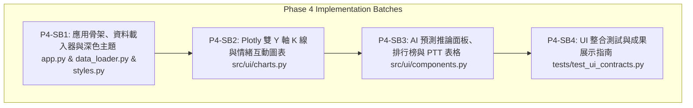

# PHASE4_BI_PLAN.md — Phase 4 Streamlit BI 視覺化儀表板與即時預測 UI 實作計畫書

> **文件使命**：本文件為 Milestone B — Phase 4 視覺化儀表板與即時預測 UI 之架構設計與小批次實作藍圖。
> 依據 `doc/PRD_Financial_Sentiment_System_v1.md` 第 4 節介面規範與 `AGENTS.md` 之工程紀律制定。

---

## 1. Phase 4 使命與視覺化架構 (Mission & UI Architecture)

### 1.1 核心使命
作為全系統面向終端使用者、量化投資決策者與面試評審的**最終成果展示門面**，Phase 4 核心任務在於：
1. **端到端即時數據流串接**：結合 PostgreSQL / 特徵工程引擎輸出之 18 欄位多模態特徵矩陣，與 Phase 3 訓練之最佳冠軍模型（`StockTrendPredictor`）。
2. **金融機構級深色模式 (Institutional Dark Mode)**：以 `#0E1117` 深色背景搭配高對比螢光配色，嚴格遵守台灣市場習慣的**「紅漲綠跌（Red Up / Green Down）」**色彩語彙（若切換美股則支援反轉）。
3. **多維雙 Y 軸互動圖表 (Interactive Multi-Axis Plotly Charts)**：
   - 上層：日 K 線（Candlestick）+ 5日 / 20日均線（MA5/MA20）。
   - 下層：社群情緒長條圖（Sentiment Score / Antweiler 看多指數）+ 每日成交量（Volume）。
   - 支援 Hover Tooltip 同步顯示價格、情緒分數與代表性新聞標題。
4. **模型決策可解釋性 (Explainable AI)**：
   - 頂部 KPI 卡片醒目顯示明日預測方向（UP/DOWN）與信心機率（Confidence Score）。
   - 視覺化展示 **Top 3 關鍵驅動因子（Top 3 Drivers）** 與特徵貢獻權重。
   - 內嵌 **8 組平行實驗橫向競技排行榜（Multi-Model Tournament Leaderboard）**。
5. **底層社群輿情明細表 (PTT Raw Articles)**：
   - 支援依多空情緒標籤篩選、分數排序與關鍵字即時搜尋。

---

## 2. 介面視覺線框圖 (Wireframe & Layout)

```text
+---------------------------------------------------------------------------------------------------------+
|  📊 金融情緒與股價趨勢預測系統 | Financial Sentiment & Trend Prediction Terminal (v1.0)                 |
+---------------------------------------------------------------------------------------------------------+
| [Sidebar 控制區]       | [頂部 KPI 卡片區]                                                                |
| - 股票標的: [2330 台積電] |  [最新股價] 1,020 TWD (+2.5%)  [市場情緒] 0.74 (高度樂觀)  [AI預測] 🟢 明日看多 78.4% |
| - 檢視區間: [近 30 天]  +-------------------------------------------------------------------------------+
| - 預測模型: [Champion] | [主要圖表區 (Plotly 雙 Y 軸互動圖)]                                             |
| - 顏色語彙: [台股紅漲綠跌]|  - 上層: 日 K 線圖 (Candlestick) + MA5 / MA20 均線                              |
|                       |  - 下層: 社群情緒長條圖 (Sentiment Mean / Antweiler 看多指數) + 成交量          |
|                       +-------------------------------------------------------------------------------+
|                       | [模型解釋與策略歸因區]                                                          |
|                       |  - [左: Top 3 驅動因子] Bullishness Index (32%), RSI-14 (24%), Sentiment 3D MA (18%) |
|                       |  - [右: 8組實驗橫向競技排行榜] 4 大演算法對照 (LR vs RF vs LightGBM vs XGBoost) |
|                       +-------------------------------------------------------------------------------+
|                       | [底部社群輿情明細 (PTT Stock 表格)]                                             |
|                       |  - 包含: 發文時間 | 標題 | 情緒分數 | 推噓數 | 關鍵字匹配 (支援搜尋與排序)        |
+---------------------------------------------------------------------------------------------------------+
```

---

## 3. 漸進式小批次實作拆解 (Small Batch Breakdown)

Phase 4 依循 `small-batch-orchestrator` 之 SOP，拆解為以下 4 個小批次：



---

### 3.1 P4-SB1 — 應用骨架、資料載入器與深色主題 (Core Layout & Data Bridge)
- **目標**：完成 Streamlit 主應用骨架、深色主題 CSS 樣式、Sidebar 控制元件與頂部 3 大核心 KPI 卡片。
- **交付檔案**：
  - `requirements.txt`（新增 `streamlit>=1.28.0`、`plotly>=5.15.0`）
  - `src/ui/__init__.py`
  - `src/ui/styles.py`（深色主題 CSS、紅漲綠跌常數與 KPI 卡片 HTML 渲染）
  - `src/ui/data_loader.py`（特徵載入器，支援 PostgreSQL 讀取與離線 Fallback 假資料，具備 `@st.cache_data` 快取）
  - `app.py`（Streamlit 應用主入口）
- **驗證標準**：
  - 頁面載入秒速響應，無 DB 時自動平滑回退離線資料（0 崩潰），頂部卡片樣式符合金融終端風格。

---

### 3.2 P4-SB2 — Plotly 雙 Y 軸 K 線與情緒多維互動圖表 (Interactive Charts)
- **目標**：實作金融多維互動圖表，直觀對比股價與社群情緒之動態關聯。
- **交付檔案**：
  - `src/ui/charts.py`
- **主要函式**：
  1. `render_price_sentiment_candlestick_chart()`：雙 Y 軸互動圖（K 線 + MA5/20 + 成交量 + Antweiler 看多指數長條圖）。
  2. `render_pnl_equity_curve_chart()`：模擬量化策略累積報酬率曲線（與 Buy & Hold 對比）。
  3. `render_feature_importance_bar_chart()`：特徵重要性分析長條圖。
- **驗證標準**：
  - Hover Tooltip 同步顯示價格、情緒分數與成交量，圖表縮放與平移流暢。

---

### 3.3 P4-SB3 — AI 預測推論面板、多模型排行榜與 PTT 輿情明細表 (Inference & Detail Views)
- **目標**：串接 Phase 3 冠軍模型即時推論，展示決策依據、跨演算法排行榜與底層原始輿情。
- **交付檔案**：
  - `src/ui/components.py`
- **主要元件**：
  1. `render_prediction_panel()`：明日漲跌預測（UP/DOWN）、信心機率進度條、前 3 大關鍵驅動特徵卡片。
  2. `render_tournament_leaderboard()`：展示 8 組平行對照實驗排行榜與 $\Delta \text{Alpha}$ 增益表。
  3. `render_raw_article_table()`：PTT 文章列表（支援依情緒高低排序、多空篩選與關鍵字搜尋）。
- **驗證標準**：
  - 推論面板輸出契約與 `StockTrendPredictor` 格式 100% 一致。

---

### 3.4 P4-SB4 — 整合測試、端到端驗證與成果發表指南 (Verification & Showcase)
- **目標**：建立 UI 資料契約自動化測試，確保在無瀏覽器之 Headless CI 環境下運算無誤，並產出展示手冊。
- **交付檔案**：
  - `tests/test_ui_contracts.py`
  - `doc/engineering/PROJECT_STATUS.md`（Phase 4 結案同步）
- **驗證標準**：
  - 全套測試套件（現有 113 項 + 新增 UI 測試 $\approx 120$ 項）100% 通過。

---

## 4. 未來自動定時排程與雲端部署規劃備忘 (Future Automation & Cloud Notes)

為展現資深資料工程師的架構完整度，專案在 Phase 4 完成後預計具備以下升級備忘：
1. **每日定時批次排程 (Daily Batch Operations)**：
   - 設定台股收盤後（14:30）自動觸發 TWSE/PTT 爬蟲、NLP 情緒分析、特徵聚合與模型每日再推論。
   - 可採用 **GitHub Actions Cron Workflow** 或 **Cloud Run Job / Cloud Scheduler**。
2. **全容器化一鍵啟動 (Docker Compose Deployment)**：
   - 透過 `docker-compose up` 一鍵同時啟動 PostgreSQL 18、ETL 排程器與 Streamlit BI 視覺化服務。
