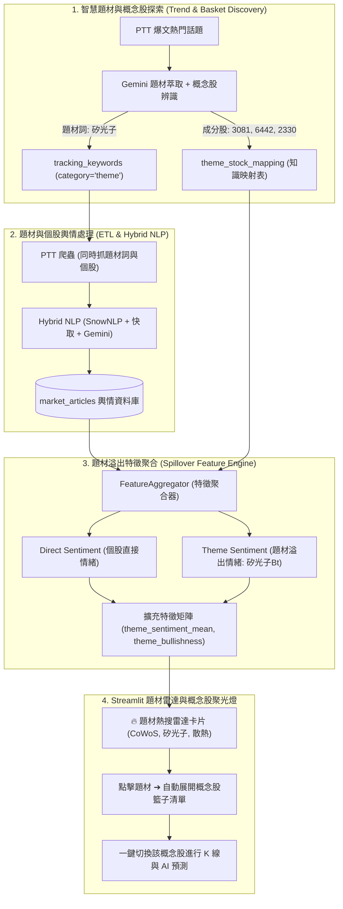

# THEMATIC_TRENDS_PLAN.md — AI 趨勢題材詞（Thematic Trends & Concept Baskets）全系統升級計畫書

> **文件定位**：本文件為「AI 題材概念詞（如：矽光子、散熱、CoWoS、降息、機器人）全系統實質效用升級」之架構設計與實作藍圖。
> 解決系統中「非結構化題材名詞在特徵工程中因缺乏個股代碼對應而被 100% 拋棄」的架構缺口，建立「知識圖譜映射 ➔ 溢出特徵工程 ➔ 題材雷達 UI 視覺化」的完整閉環。

---

## 1. 痛點剖析與升級目標 (Problem & Objective)

### 1.1 現有資料流斷層 (The Missing Link)
1. **探索與爬蟲層**：`trend_discover.py` 與 `ptt_scraper.py` 成功抓取了大量題材文章（如 `矽光子`、`CoWoS`、`散熱`），並在 `nlp_processor.py` 中投入運算資源計算了情緒分數存入 `market_articles`。
2. **特徵工程層斷層**：
   - 在 `FeatureAggregator` 中，文章透過 `inner join entity_mapping` 換取 `stock_id`。
   - 由於 `entity_mapping` 僅有一對一的個股名稱（如 `台積電 ➔ 2330`），**所有非個股代碼的題材名詞因查無 `stock_id`，在特徵聚合時被 100% 拋棄（Drop）**。
3. **UI 視覺化層缺口**：
   - 終端使用者在 Streamlit 儀表板上無法得知當前市場熱門題材是什麼、包含哪些成分股，亦無法從題材一鍵連動個股。

### 1.2 升級核心目標
1. **題材-成分股知識圖譜關聯（1-to-N Concept Basket Mapping）**：
   - 一個題材自動關聯 3~5 檔核心受惠概念股（如 `矽光子` ➔ `3081 聯亞`、`6442 光聖`、`3163 波若威`、`2330 台積電`）。
2. **題材情緒溢出效應（Thematic Spillover Sentiment）**：
   - 個股在聚合特徵時，不僅能吃到直接提及自己的文章，還能按權重融入「所屬概念題材」的熱度與情緒分數（$B_{\text{theme}}$）。
3. **Streamlit「🔥 AI 題材熱搜雷達與概念股聚光燈」**：
   - 在 UI 頂部建立專屬題材雷達卡片，呈現熱度、看多指數與成分股，支援**一鍵點擊秒速切換個股預測**。

---

## 2. 全系統端到端架構演進 (Architecture Overview)



---

## 3. 三大核心模組設計細節 (Detailed Design)

### 3.1 儲存層：題材-成分股知識映射表 (`theme_stock_mapping`)
在資料庫新增專屬關聯表：

```sql
CREATE TABLE IF NOT EXISTS theme_stock_mapping (
    theme_keyword VARCHAR(50) NOT NULL,          -- 題材名詞 (如: '矽光子', '散熱', 'CoWoS')
    stock_id VARCHAR(20) NOT NULL,                -- 概念成分股代號 (如: '3081', '3324', '2330')
    stock_name VARCHAR(50),                       -- 股票名稱 (如: '聯亞', '雙鴻', '台積電')
    relevance_weight NUMERIC(3, 2) DEFAULT 1.0,   -- 關聯權重 (1.0=核心龍頭, 0.5=周邊受惠)
    updated_at TIMESTAMP DEFAULT CURRENT_TIMESTAMP,
    PRIMARY KEY (theme_keyword, stock_id)
);
```

#### 內建初始題材種子資料 (Initial Concept Seeds)：
* **💡 矽光子 (Silicon Photonics)**：`3081` (聯亞), `6442` (光聖), `3163` (波若威), `2330` (台積電)
* **❄️ 散熱模組 (Thermal Management)**：`3324` (雙鴻), `3017` (奇鋐), `3653` (健策)
* **📦 CoWoS 先進封裝**：`3131` (弘塑), `3583` (辛耘), `6187` (萬潤), `2330` (台積電)
* **🤖 AI 伺服器與代工**：`2382` (廣達), `2317` (鴻海), `6669` (緯穎), `NVDA` (輝達)

---

### 3.2 探索層升級：Gemini 自動概念股辨識 (`trend_discover.py`)
升級 Prompt，讓 Gemini 在挖掘出熱門名詞時，同時回傳對應的 3~5 檔台美股代表成分股代碼：

```json
{
  "trends": [
    {
      "theme": "矽光子",
      "stocks": [
        {"stock_id": "3081", "name": "聯亞", "weight": 1.0},
        {"stock_id": "6442", "name": "光聖", "weight": 1.0},
        {"stock_id": "2330", "name": "台積電", "weight": 0.8}
      ]
    }
  ]
}
```

---

### 3.3 特徵工程層升級：題材情緒溢出加權聚合 (`FeatureAggregator`)
在 `generate_daily_features()` 中，結合直接情緒與所屬題材情緒：

$$\text{Final Sentiment} = \alpha \cdot \text{Sentiment}_{\text{direct}} + (1 - \alpha) \cdot \sum w_k \cdot \text{Sentiment}_{\text{theme}_k}$$

* 若當日沒有直接提及「聯亞」，但「矽光子」題材討論熱烈且看多指數 $B_t = +1.8$，聯亞依然能獲取該題材溢出的正面動能特徵！

---

### 3.4 UI 展示層升級：🔥 AI 題材熱搜雷達 (`src/ui/components.py` & `app.py`)

在 Streamlit 儀表板頂部渲染高質感的題材雷達卡片：

```text
+-----------------------------------------------------------------------------------------------+
| 🔥 市場熱門題材雷達 (AI Thematic Concept Radar)                                                |
+-----------------------------------------------------------------------------------------------+
| [ 💡 矽光子 (Silicon Photonics) ]    [ ❄️ 散熱模組 (Thermal) ]         [ 📦 CoWoS 先進封裝 ]     |
| • 討論聲量: 48 篇                    • 討論聲量: 32 篇                 • 討論聲量: 26 篇         |
| • 看多指數: +1.82 (極度看好)          • 看多指數: +1.15 (偏多)          • 看多指數: +0.94 (穩定)  |
| • 概念成分股: 聯亞, 光聖, 台積電      • 概念成分股: 雙鴻, 奇鋐, 健策    • 概念成分股: 弘塑, 辛耘  |
| 👉 [點擊直接檢視 3081 聯亞預測]      👉 [點擊直接檢視 3324 雙鴻預測]   👉 [點擊檢視 3131 弘塑]   |
+-----------------------------------------------------------------------------------------------+
```

* 使用者點擊「聯亞 3081」或「雙鴻 3324」，全頁面（K 線圖、AI 預測、特徵重要性）自動連動載入！

---

## 4. 漸進式小批次實作路徑 (Small Batch Breakdown)

| 小批次序號 | 模組名稱 | 核心交付內容 | 預計測試 |
|---|---|---|---|
| **P4-EXT-1** | **概念知識庫與 AI 自動映射** | 建立 `theme_stock_mapping` 資料表；升級 `trend_discover.py` 與 `db_writer.py`（自動寫入題材與成分股映射）。 | 4 項單元測試 |
| **P4-EXT-2** | **題材情緒溢出特徵引擎** | 升級 `FeatureAggregator`，將題材文章依映射表加權融合至概念股特徵中，輸出題材動能指標。 | 4 項特徵整合測試 |
| **P4-EXT-3** | **Streamlit 題材雷達與一鍵選股 UI** | 在 `src/ui/components.py` 實作題材雷達卡片、概念成分股展開與一鍵切換預測功能。 | 3 項 UI 契約測試 |

---

## 5. 驗證與安全約束 (Invariants & Safety)
1. **零回歸破壞**：現有 124 項自動化測試持續維持 100% PASS。
2. **零阻斷 Fallback**：若未抓到題材詞，特徵工程與 UI 維持原本個股直接情緒計算，保證 0 異常崩潰。
