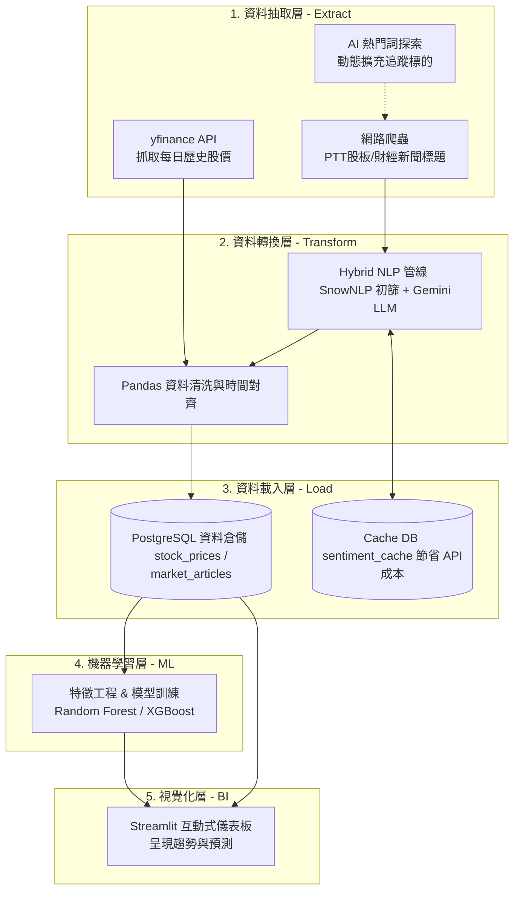

# 產品規劃書 (PRD)：金融情緒與股價趨勢系統

> **版本：v2**（2026-09-16，文件對齊輪）。**檔名維持 `_v1.md` 不變**——本檔不在
> `gate0_contract_check.py` 的 `DOC_PATHS` 受驗清單內（該清單只含 7 份 Gate 0 交付物），
> 但全 repo 至少 14 個檔、61 處以檔名字面引用本文件（`CLAUDE.md` §0.2、`AGENTS.md`、
> 多則 `DECISIONS.md` ADR、七份 `gates/closed/` 文件等），改檔名同樣會造成大量斷鏈；
> 版本號改在本頁與下方修訂紀錄表宣告。

### 修訂紀錄

| 版本 | 日期 | 變更摘要 | 依據 |
|------|------|---------|------|
| v1 | 2026-08-26 | 原始版本（`UG-G1-SB5` 文件全面校正時最後一次實質修訂，commit `31f5507`） | — |
| v2 | 2026-09-16 | Gate 3 主線轉向 Timeout gating（原方向性雙模式預測未達標）；§3 Phase 3 加現況註記；成功指標改指向 Master Plan §11.1 | `DEC-041`、`RISK-030`、`UG-G3-SB7` Gate B |

## 1. 專案概述 (Project Overview)
- **專案名稱：** 金融情緒與股價趨勢預測系統 (Financial Sentiment & Stock Trend Predictor)
- **專案目標：** 打造一個端到端 (End-to-End) 的自動化資料管線，整合 API 金融數據與網路論壇情緒，透過機器學習輔助分析股價未來趨勢，並以 BI 儀表板視覺化呈現。
- **【2026-09-16 追加】Gate 3 主線轉向說明：** 原規劃的「機器學習輔助分析股價未來趨勢」
  於 `UG-Gate-3` 實測後有明確調整——四個 Specialist 模型與 Meta-Learner 對 `target_up_down`
  （漲跌方向）在樣本內（Meta-Eval 段）與樣本外（Holdout，折 33-42）的 OOF AUC 皆僅
  0.50～0.52（近乎隨機，`RISK-030`），現行特徵集下無可偵測的方向判別力；`DEC-041`
  （2026-09-16 `APPROVED`）裁決 Gate 3 後續主線改以 `target_triple_barrier` 的 Timeout
  （何時不宜交易）類別為對象，產品輸出形態由「漲跌方向預測」轉為**「Timeout 可信度 gating
  訊號」**——即模型不再宣稱能預測漲跌，而是標示「此刻不建議交易」的觀望信號。此轉向已在
  Holdout 驗證：覆蓋率 92.52%、精準度相對隨機基線提升 10.73 倍、召回率 80.28%（`UG-G3-SB7`
  Gate B，2026-09-16）。**同一次驗證也揭露**：僅用波動率分位數、不訓練任何模型的規則
  （`volatility_coverage_matched`）在 Holdout 上表現幾乎等效（精準度提升 10.30 倍、召回率
  82.16%），ML 管線相對於單變數波動率規則的邊際貢獻**尚未定論**，已登記候補案，排在
  `UG-Gate-4` 啟動前裁決。方向性預測特徵層面的改進案同樣列為候補（見
  `doc/governance/PROJECT_STATUS.md` §0.5），皆非本輪範圍。完整四項量化目標現況見
  `doc/upgrade/SYSTEM_UPGRADE_MASTER_PLAN.md` §11.1。
- **核心價值 (面試亮點)：** 展示處理異質資料源 (API + 爬蟲)、資料清洗、資料庫設計、機器學習應用，以及具備容錯機制的自動化 ETL 流程能力。
- **進階技術亮點 (新增)：** 導入 LLM API 混合批次運算 (Hybrid Pipeline)、資料庫快取機制 (Caching) 以優化成本，並具備 AI 熱門詞彙自動探索與 Batch Checkpointing 斷點續傳防護網。

---

## 2. 系統架構與流程圖 (System Architecture & Flowchart)
本專案的資料流轉從抽取 (Extract)、轉換 (Transform)、載入 (Load) 到機器學習與商業智慧 (BI) 呈現。以下為系統完整的架構流程圖。

---

## 3. 核心功能與技術棧 (Core Features & Tech Stack)

### Phase 1: 異質資料收集模組 (ETL - Extract & Load)
- **功能：** 定時抓取股票 K 線資料 (TWSE / yfinance) 與 PTT 股板閒聊文/新聞標題。追蹤策略採「核心股票池 (如：台積電、廣達、環球晶、輝達)」、「總經關鍵字 (降息、非農)」結合「AI 熱門題材與概念股籃子自動探索 (如：矽光子 ➔ 聯亞/光聖/台積電；散熱 ➔ 雙鴻/奇鋐)」。
- **技術：** Python (`requests`, `BeautifulSoup`, `yfinance`)
- **防呆機制：** 針對爬蟲失敗設計 Retry 機制 (實作純 Python 指數退避 Exponential Backoff) 與 Error Log 紀錄，確保系統高可用性。

### Phase 2: 資料轉換、NLP 情緒處理與機構級特徵工程 (ETL - Transform & Feature Engineering)
- **功能：** 將非結構化的文章標題轉換為「情緒分數」，並透過「次一交易日 Roll-Forward 歸併」與股價時間戳記精確對齊。
- **技術：** `pandas`, `numpy`, `jieba` (中文分詞) + 情感詞典 (SnowNLP) + LLM API (`gemini-flash-latest`)。
- **Hybrid NLP 策略：** 採用三階段處理：(1) 比對 PostgreSQL `sentiment_cache` 快取去重；(2) SnowNLP 初篩過濾極端值；(3) 針對模糊地帶打包成 JSON 批次呼叫 Gemini，達到精準度與 API 成本的完美平衡。
- **排程防護：** 實作 Strict Batch Checkpointing (嚴格斷點續傳) 機制，確保系統中斷重啟後不漏算、不重算、不偽造成功。
- **題材情緒溢出加權融合 (Thematic Spillover)：** 實作「直接個股情緒 (70%) + 題材溢出情緒 (30%)」原位動態加權融合；當冷門概念股無直接討論時，採 100% 題材溢出補位，解決冷門日 0.5 鈍化問題。
- **機構級特徵矩陣（`LEGACY_17` 版本化契約，見 `doc/upgrade/contracts/FEATURE_REGISTRY.md`）：** 純 NumPy/Pandas 向量化實作 Antweiler & Frank (2004) 看多指數（$B_t$）與一致性指數（$A_t$）、Wilder's RSI-14、5日/20日滾動年化歷史波動率、時序均線與情緒滯後特徵。

### Phase 3: 機器學習趨勢預測模型 (ML)
- **功能：** 支援「雙模式預測架構」（模式一：08:30 盤前即時反應模型；模式二：15:30 盤後動能延續模型）。運用 `LEGACY_17` 版本化特徵契約之歷史特徵矩陣，預測隔日股價對數報酬率與漲跌趨勢（$Y_T$）。
- **【2026-09-16 現況】**：上述「雙模式預測架構」與方向漲跌預測（$Y_T$）為**原規劃**。
  依 `DEC-041`，Gate 3 方向性預測（`target_up_down`）**已停做**（`RISK-030` 樣本外 AUC
  0.50～0.52，無排序訊號）；現行產品輸出改為 `target_triple_barrier`／Timeout 類的
  gating 觀望訊號（見上方 §1 追加段落與 `UG-G3-SB6`／`SB7` Gate B）。本段原文保留供追溯
  規劃意圖，**不代表現行系統行為**。
- **時序驗證防護：** 嚴格遵循「零前視偏誤（Zero Look-ahead Bias）」時間約定，最後一日目標為 `NaN`，並採用滾動前向交叉驗證（Walk-Forward Validation）杜絕未來資料洩漏。
- **技術：** `scikit-learn` (Random Forest, Logistic Regression), `xgboost`, `lightgbm`。

### Phase 4: BI 互動式儀表板 (Dashboard)
- **功能：** 讓使用者動態查詢不同股票代碼，檢視歷史股價、看多/一致性指數與 RSI/波動率走勢，並查看 ML 模型的預測結果。支援頂部「🔥 AI 題材熱搜雷達」，一鍵點選成分股秒速連動全畫面預測。
- **技術：** `Streamlit` (快速建立網頁介面), `Plotly` (可互動式財務圖表)。

---

## 4. 介面設計規劃 (UI/UX Design)
基於「線框圖 (Wireframe) 定骨架，示意圖 (Mockup) 定視覺」的原則，介面規劃如下：

### 4.1 儀表板線框圖 (Wireframe 骨架)
*專注於功能區塊與資訊架構擺放，確保使用者操作動線合理。*

- **左側邊欄 (Sidebar - 控制區)：**
  - `[下拉選單]` 股票標的選擇 (選項由系統資料庫既有的預設池與 AI 探索清單提供，保證秒速載入)。
  - `[動態新增]` 自選股即時擴充介面。
  - `[日期選擇器]` 檢視區間設定 (如：近 7 天, 近 30 天, 近 60 天, 近 90 天)。
  - `[色彩語彙]` 台股 (紅漲綠跌) vs. 美股 (綠漲紅跌) 一鍵切換。
- **頂部雷達區 (Thematic Concept Radar - 題材熱搜)：**
  - `[雷達卡片群]` 顯示當前市場最熱門題材 (如矽光子、散熱模組、CoWoS、AI伺服器)，呈現討論篇數、看多指數與多空評級。
  - `[一鍵選股]` 點選題材成分股標籤 (如 3081 聯亞、3324 雙鴻)，全畫面即時連動切換預測。
- **數據核心區 (KPI Cards - 核心指標)：**
  - `[卡片 1]` 最新收盤價與單日漲跌幅
  - `[卡片 2]` 當日市場綜合情緒總分 (Antweiler 看多指數 $B_t$ 與一致性指數 $A_t$)
  - `[卡片 3]` AI 預測明日趨勢 (上漲 / 下跌機率與信心水準)
- **中央主要圖表 (Main Chart - 視覺分析)：**
  - `[圖表區]` 採雙 Y 軸設計。上方呈現 K 線圖 (Candlestick) 追蹤價格；下方疊加每日情緒分數的長條圖 (Bar Chart) 以對比趨勢。
  - `[量化回測]` AI 策略 vs. Buy & Hold 累積資產淨值曲線 (Equity Curve)。
  - `[特徵貢獻]` Top 8 決策因子特徵重要性長條圖 (SHAP / MDI)。
- **底部資料表 (Data Table - 原始數據)：**
  - `[表格區]` 列表呈現近期的 PTT 新聞與標的討論文章，支援情緒標籤篩選、關鍵字搜尋與時間排序。

### 4.2 視覺示意圖原則 (Mockup Guidelines)
*最終成品的視覺與互動標準，賦予數據生命力。*

- **色彩計畫 (Color Scheme)：** 採用深色模式 (Dark Mode) 以突顯螢光色的金融圖表。嚴格遵守台灣股市習慣的「紅漲綠跌」色彩語彙（若針對美股則反之，需保持一致性）。
- **互動性 (Interactivity)：** 使用者將滑鼠游標懸停 (Hover) 於圖表節點時，Tooltip 必須同時顯示「當日價格」、「情緒分數」與「代表性關鍵新聞標題」。
- **視覺層次：** 預測結果的 KPI 卡片需使用高對比度的醒目色彩 (例如預測上漲用亮紅色框線)，讓決策者一眼就能看到 ML 模型的輸出建議。

---

## 5. 未來擴充空間 (Future Scalability)
為展現資深資料工程師 (Senior DE) 的架構思維，專案架構已保留以下擴充升級空間：
- **使用者動態輸入搜尋 (Asynchronous MQ)：** 未來可導入 RabbitMQ 或 Redis 建立非同步佇列，支援使用者輸入任意冷門股，由背景觸發爬蟲與 LLM 運算後推播至前端。
- **自動化任務編排 (Orchestration)：** 未來可導入 `Apache Airflow` 或 `Prefect`，將 ETL 拆分為明確的 DAG (有向無環圖)，管理複雜的任務依賴與失敗重試機制。
- **容器化部署 (Containerization)：** 撰寫 `Dockerfile` 與 `docker-compose.yml`，將爬蟲環境、資料庫與前端網頁打包，達到「一鍵在任何電腦上啟動系統」的目標。
- **持續整合/持續部署 (CI/CD)：** 結合 `GitHub Actions`，當推上新程式碼時，自動執行單元測試並部署至雲端伺服器 (如 AWS EC2 或 GCP Cloud Run)。
