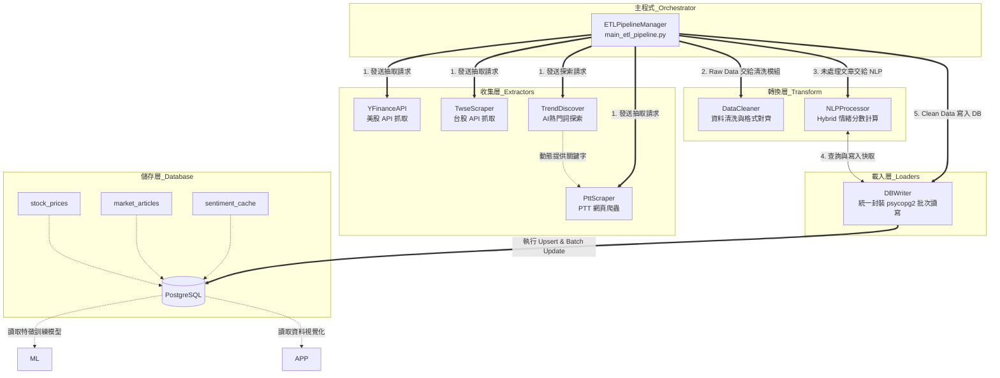

# 系統設計規格書 (SDD)：金融情緒與股價趨勢系統

> **版本：v2**（2026-09-16，文件對齊輪）。**檔名維持 `_v1.md` 不變**（本檔不在
> `DOC_PATHS` 受驗清單內，但同 PRD，全 repo 大量檔名字面引用，理由見該檔 A1）。

### 命名對照表【本輪新增，避免 Gate 編號混淆】

> 本文件 §2 內有四個小節標題字面寫「Gate 2」「Gate 3」「Gate 4」「Gate 5」——
> 這是**前任團隊（2026-08-20 前，`doc/archive/PRE_CODEX_REMEDIATION_PLAN.md` 所屬計畫）
> 的 Phase Gate 編號**，與現行 `doc/upgrade/` 升級計畫的 `UG-Gate-1～4` 是**同名不同物**。
> 下表對照，本輪起四節標題改稱 `Legacy Phase Gate N` 以資區別，原文一字不改，僅加前綴。

| 本文件內名稱（本輪起） | 所屬計畫 | 對應現行升級計畫 Gate | 關閉日期／commit |
|---|---|---|---|
| Legacy Phase Gate 2（原「Gate 2」） | 前任團隊 `PRE_CODEX_REMEDIATION_PLAN.md` | 與 `UG-Gate-2`（2026-09-06 關閉）無對應關係，純編號巧合 | 2026-08-20 前，見 `doc/archive/` |
| Legacy Phase Gate 3（原「Gate 3」） | 同上 | 與 `UG-Gate-3`（2026-09-16 關閉）無對應關係，純編號巧合 | 2026-08-20，Commit `8ef18cd` |
| Legacy Phase Gate 4（原「Gate 4」） | 同上 | 與 `UG-Gate-4`（**尚未啟動**）無對應關係 | 見 `doc/archive/` |
| Legacy Phase Gate 5（原「Gate 5」） | 同上 | 現行計畫無對應編號 | 見 `doc/archive/` |

> **現行升級計畫的 Gate 狀態一律查 `doc/governance/PROJECT_STATUS.md` §0.2**，
> 不要用本文件內的「Gate N」字面去對應。

### 修訂紀錄

| 版本 | 日期 | 變更摘要 | 依據 |
|------|------|---------|------|
| v1 | 2026-08-26 | 原始版本（`UG-G1-SB5`，commit `31f5507`） | — |
| v2 | 2026-09-16 | 新增命名對照表；四個 Legacy Phase Gate 標題加前綴；§2 模組表補 `UG-Gate-3` ML 管線五個模組；新增「`UG-Gate-3` ML 管線」小節；新增「`UG-Gate-2` Feature Store 落地」小節（DEC-029～034、039 逐條落地引用） | 段1盤點 D3／D4／D5 |

## 1. 系統架構圖 (System Architecture & Module Relationships)
本系統採用「模組化 (Modularity)」與「關注點分離 (Separation of Concerns)」的設計模式。由主程式 (`main_etl_pipeline.py`) 擔任指揮官，協調收集層、轉換層與載入層，最終將乾淨的資料寫入 PostgreSQL。系統全面採用物件導向 (OOP) 重構，提升記憶體管理與資源共享效率。

---

## 2. 專案目錄與檔案說明 (Directory & File Descriptions)

### 📁 環境配置與基礎建設 (Infrastructure)
*   **`.devcontainer/`**: 開發環境配置資料夾，確保開發環境的一致性。
*   **`docker-compose.yml`**: 定義應用程式與 PostgreSQL 資料庫容器的網路與對接關係。
*   **`requirements.txt`**: Python 專案所需的第三方套件清單 (如 `pandas`, `psycopg2`, `yfinance` 等)。

### 📁 核心程式碼 (`src/`)
所有業務邏輯皆按功能拆分，提升程式碼的可讀性與可維護性。全面導入 OOP 類別設計。

#### 1. 收集層 (`src/extractors/`) - *負責向外部取得原始資料 (Raw Data)*
*   **✅ `yfinance_api.py`**: (YFinanceAPI): 呼叫 Yahoo Finance API，抓取美股 (如 AAPL, NVDA) 歷史股價。具備重試機制。
*   **✅ `twse_scraper.py`**: (TwseScraper): 請求台灣證交所 API，抓取台股每日交易資訊。導入 tenacity 速率限制。
*   **✅ `trend_discover.py`** (TrendDiscover): 整合 AI 自動探索熱門財經詞彙 (如爆量股、熱門推文)，動態擴充 PTT 爬蟲的搜尋關鍵字池。
*   **✅ `ptt_scraper.py`**: (PttScraper): 解析 PTT 股板 HTML，根據關鍵字過濾並抓取文章資訊。內建指數退避 (Exponential Backoff) 防禦 PTT 封鎖。  
#### 2. 轉換層 (`src/transform/`) - *負責資料清洗、型別轉換與商業邏輯*
*   **✅ `data_cleaner.py`**: (DataCleaner): 包含針對台股、美股與 PTT 資料的專屬清洗邏輯。負責統一時間格式、補齊缺失欄位，並對齊資料庫 Schema。
*   **✅ `nlp_processor.py`**: (NLPProcessor): 封裝 Hybrid 混合管線，整合中文分詞 (`jieba`)、SnowNLP、exact-title cache membership（完全相同標題的快取命中）與 `gemini-flash-latest` JSON 回應驗證，將文章標題轉化為數值化的 `sentiment_score`。非 fuzzy SnowNLP result 可完成；fuzzy item 只有有效 cache hit 或完整有效 Gemini result 才能完成。

#### 3. 載入層 (`src/loaders/`) - *負責與資料庫進行安全且高效的互動*
*   **✅ `db_writer.py`**: (DBWriter): 封裝 `psycopg2` 連線邏輯與 `execute_values` 批次寫入功能，管理 `stock_prices`、`market_articles`、`sentiment_cache` 與 tracking configuration。Read methods 以 exception propagation 區分 DB failure 與 successful empty result，並驗證 cache score 是 0.0～1.0 的有限數值。

#### 4. 應用與 ML 層 (`src/ml/` & `src/ui/`)
*   **✅ `model_trainer.py`**: 從資料庫讀取價格與情緒特徵，訓練機器學習分類器（Logistic Regression／Random Forest／LightGBM／XGBoost）來預測股價趨勢；`src/ml/evaluator.py` 的 `MLEvaluator.evaluate_tournament()` 可執行 4 演算法 × 2 特徵集共 8 組平行對照實驗並產出排行榜（見下方 `app.py`／`src/ui/` 條目）。
*   **✅ `src/ml/time_series_split.py`**（`UG-G1-SB1`）: `WalkForwardSplitter`，Purged
    Walk-Forward 折切分邏輯本身（`embargo_days` 等參數化窗口定義）。
*   **✅ `src/ml/specialist_training.py`**（`UG-G3-SB3`）: 三個 Specialist 模型（Random Forest／
    LightGBM／XGBoost）的訓練封裝，rolling／expanding 兩模式、兩對照臂（A/B）。
*   **✅ `src/ml/stacking.py`**（`UG-G3-SB4`／`SB7`）: OOF Stacking Meta-Learner（`Meta(A)-LR`）
    契約組裝；`iter_oof_folds()` 產生折 0-32 OOF 預測，`iter_holdout_folds()`（`UG-G3-SB7`
    新增，`DEC-040` Holdout 邊界定義，兩函式互補迭代切分空間）產生 Holdout（折 33-42）
    OOF 重生。
*   **✅ `src/ml/calibration.py`**（`UG-G3-SB5`）: 機率校準，`PLATT_C=1e6` 未正則化 Platt
    擬合；`CALIBRATION_METHOD_BY_TARGET` 宣告層級常數限定 `target_triple_barrier` 僅允許
    `sigmoid`（Platt），`target_up_down` 另允許 `isotonic`（`MIN_MINORITY_SAMPLES_FOR_ISOTONIC`
    門檻未觸發，實際未使用）。
*   **✅ `src/ml/gating.py`**（`UG-G3-SB6`／`SB7`）: Timeout gating 核心，`compute_gating_metrics()`
    產生判準四元組（覆蓋率／精準度／召回／lift）、`select_theta_star()` 門檻 `θ*` 選定、
    `regime_diagnostic()` 波動率分位組行為診斷、`assert_holdout_isolation()`／
    `assert_holdout_only()` 互補邊界斷言、`assert_calibrator_matches_sb5()` 校準器凍結核對。
*   **✅ `app.py` 與 `src/ui/`（原規劃檔名 `dashboard.py`，實際實作為此路徑）**: 使用 Streamlit 建立前端終端，將資料庫中的結果進行視覺化圖表呈現。核心架構為 `DataMode` 四狀態資料來源透明化（`REAL`／`DEMO`／`EMPTY`／`ERROR`，DEC-012）：`src/ui/data_loader.py` 各公開函式回傳 `(value, DataMode)` 元組，`src/ui/components.py`／`src/ui/charts.py` 依 mode 渲染對應橫幅／浮水印／佔位圖表，DB 連線失敗時**不自動退回模擬資料**，僅顯示明確錯誤說明。模型競技排行榜（`render_tournament_leaderboard`）已改為從 `models/artifacts/tournament_results.json` artifact 讀取（DEC-020），不再是 UI 層字面常數；artifact 尚未產出時顯示 `EMPTY`「尚未完成模型競技」。

### 📁 專案進入點與自動化指令
*   **✅ `main_etl_pipeline.py`**: (ETLPipelineManager): 系統總指揮官 (Orchestrator)。負責實例化所有模組並注入資源，定義資料流動的順序 (Extract -> Transform -> Load)。NLP pending rows 以 `sentiment_score IS NULL` 選取；只有 processor 正常回傳後才呼叫 article score update，processor failure 會停止目前 invocation。
*   **✅ `database/init_db.py`**: 新資料庫的 bootstrap initializer（初始化執行器）；從環境變數取得連線設定，讀取並以單一 transaction 執行 canonical `schema.sql`。
*   **✅ `database/schema.sql`**: Database DDL Single Source of Truth（資料庫 DDL 單一真實來源），定義 fresh environment 所需的 tables、constraints、indexes 與 bootstrap seed；含 §5 `schema_version` 版本追蹤表定義。
*   **✅ `database/db_target_guard.py`**（UG-G1-SB4，DEC-021）: `assert_safe_migration_target()` 偵測連線目標是否疑似真實開發資料庫（host/port 未覆寫預設值，或 database 名稱不符臨時 DB 命名慣例），偵測到即 `raise SystemExit`，不建立任何連線；RISK-013 根本解。
*   **✅ `database/apply_migrations.py`**（UG-G1-SB4，DEC-010）: Migration runner，掃描 `database/migrations/` 目錄依檔名編號排序套用；建立資料庫連線前強制呼叫 `assert_safe_migration_target()`；單一遷移失敗即 `rollback()` 並回傳非 0。
*   **✅ `database/migrations/001_baseline.sql`**（UG-G1-SB4）: 首份 baseline migration，向已存在的 fresh-init 資料庫補登 `schema_version` 首筆版本紀錄。

### Database Schema Initialization Boundary（資料庫綱要初始化邊界）

`database/schema.sql` 是本專案唯一的 Database DDL authority（資料庫 DDL 權威來源）。Python initializer 不維護第二份內嵌 DDL，以降低 Schema drift（綱要漂移）風險。

`database/init_db.py` 的責任限定為：

- 由環境變數取得 database configuration。
- 建立 database connection 與 transaction boundary。
- 定位並以 UTF-8 讀取相鄰的 `database/schema.sql`。
- 執行 canonical schema，成功時 commit，失敗時 rollback。
- 傳遞錯誤，使失敗產生 non-zero process exit。
- 關閉 cursor／connection 等 resources。

**Initialization（初始化）不等於 Migration（遷移）。** `CREATE TABLE IF NOT EXISTS` 只支援新的空資料庫或 bootstrap initialization，不負責 existing schema upgrade、legacy database repair、column／constraint drift 修復，也不處理其他環境可能存在的 `daily_model_features`。

Bootstrap seed 只服務新資料庫的預設設定。`tracking_keywords` 與 `entity_mapping` 使用 `ON CONFLICT DO NOTHING`，使 initializer 重跑時不覆寫 Runtime Configuration（執行期設定）；既有 seed 的修改屬於 migration 或 controlled data change（受控資料變更）責任。

Gate 1 已在隔離 PostgreSQL 18 環境驗證 fresh initialization、第二次重跑、runtime configuration preservation、Schema Fingerprint stability、failure exit semantics 與 transaction rollback。這些證據不代表 existing database migration safety 或 production readiness。

### Schema Migration Boundary（資料庫遷移邊界，UG-G1-SB4）

上一節的缺口——existing schema upgrade——由 `database/apply_migrations.py`（DEC-010）
填補，與 `init_db.py` 職責分離、互不取代：

- `schema_version` 表（`database/schema.sql` 與 `database/migrations/001_baseline.sql`
  皆定義，全新建庫與既有升級路徑各自涵蓋）追蹤已套用的遷移版本、描述、時間與內容
  SHA-256 雜湊（`checksum`，供事後竄改偵測）。
- `apply_migrations.py` 掃描 `database/migrations/` 目錄，依檔名編號嚴格排序，
  僅套用版本號大於目前已套用版本的遷移，每個遷移在獨立 Transaction 內執行，
  失敗時自動 ROLLBACK 且版本不推進。
- **RISK-013 根本解整合（DEC-021）**：建立資料庫連線前，`apply_migrations.py`
  強制呼叫 `database/db_target_guard.py` 的 `assert_safe_migration_target()`——
  偵測到連線目標疑似為真實開發 DB（host/port 為未覆寫預設值，或 database 名稱
  不符臨時 DB 命名慣例）時，於連線建立前即 `raise SystemExit`，不執行任何連線
  或寫入動作。

**驗證邊界**：截至 UG-G1-SB4，僅 `001_baseline.sql`（建立 `schema_version` 表本身）
一個遷移腳本已實作並於隔離容器（非 `postgres-data` 掛載）驗證 fresh apply、
冪等重跑、版本檢查、故意失敗遷移的 rollback，以及以真實 DB 座標執行時連線前
即被拒絕。`002_expand_ml_features.sql`／`003_expand_articles.sql`（`DB_MIGRATION_PLAN.md`
§4.2／§4.3 已規劃）屬 Gate 2／3 範圍，尚未實作；多遷移序列間的實際互動
（例如遷移間相依性）尚待該等 Gate 各自的 SB 驗證。分層 Rollback 策略第 5 層
（`pg_dump` 完整還原，需 PO 核准）本次未觸發，因全程僅對隔離臨時 DB 操作，
未曾對真實開發 DB 執行過 migration。

### Runtime Read & NLP Completion Boundary（執行期讀取與 NLP 完成邊界）

Gate 2 採用 DEC-003 的 DB read、cache 與 strict fuzzy completion contracts。

#### Database Read Contract（資料庫讀取契約）

- `DBWriter.fetch_data()` 只有在 query 成功但零筆資料時回傳 empty DataFrame；connection／execute failure 向上傳遞。
- `DBWriter.fetch_cached_scores()` 的 empty input 或成功零筆 matching rows 回傳 `{}`；DB failure 與非 numeric、NaN、Infinity、低於 0 或高於 1 的 cache score 會 raise，不會被當成 cache miss。
- `DBWriter.fetch_active_keywords()` 只有在 query 成功但零筆資料時回傳 `[]`；DB failure 向上傳遞。
- `ETLPipelineManager` 不把上述 exception 轉成「所有文章完成」、「零個追蹤關鍵字」或「所有 ETL 任務完成」；目前 control flow 會停止 invocation。

這個 contract 沒有引入 explicit Result type，也不代表所有外部 extractor 已具備相同 failure semantics。

#### Cache Membership Contract（快取命中契約）

- Cache hit 依 successfully returned exact-title mapping 的 membership 判定，不由 cached score 是否仍落在 0.4～0.6 反推。
- `0.0`、`0.45`、`0.50`、`0.55` 都是可重用的有效 cache hit，不再送入 Gemini。
- 只有 original SnowNLP fuzzy 且 exact title 未命中 cache 的 row 才是 LLM candidate。
- Duplicate title 可以讓多個 rows 共用 cache；cache miss 時，各 row 仍保留獨立 candidate ID。
- 本契約尚未定義 title normalization、cache version、TTL、模型版本或跨來源內容 key；新增社群來源與留言前仍需另做 Data Contract。

#### Strict Fuzzy Completion（嚴格模糊項目完成語意）

1. SnowNLP 先計算 local scores；非 fuzzy result 可依目前 Hybrid MVP 規則完成。SnowNLP 非預期 exception 不會轉成 `0.5`，而是停止目前 batch。
2. Fuzzy row 先查 exact-title cache；有效 cache hit 即為正式結果，包括 neutral score。
3. Uncached fuzzy rows 才送 Gemini。Missing API key、Gemini exception 或無效回應都會停止目前 batch。
4. Gemini whole response 必須先通過下列驗證：
   - top-level 是 JSON object；
   - 沒有 duplicate keys；
   - response IDs 與本次 expected candidate IDs 完全一致且可無歧義映射；
   - 每個 score 是非 bool 的 numeric finite value，且在 0.0～1.0；
   - Gemini 正式回傳 `0.5` 是成功結果。
5. 整份 response 完成驗證前，不修改輸入 DataFrame、不寫入 `sentiment_cache`。
6. 驗證完成後才準備 cache records；cache write failure 繼續向上傳遞，article checkpoint 尚未推進。
7. Processor 正常回傳後，Orchestrator 才呼叫 `update_sentiment_scores()`。Processor failure 不更新 article scores，也不在同一 invocation 形成 busy retry loop；資料仍可由下一次 invocation 以 NULL score 重新選取。

上述「current-batch fail-fast」不是跨表 transaction 保證。`sentiment_cache` write 與 `market_articles` update 是分開的 DB operations；若 cache 已成功但 article update 失敗，cache 可能保留並在下次重用。現有 Schema 也不持久記錄最終 score 來自 SnowNLP、cache 或 Gemini。

#### Legacy Phase Gate 2 Verification Boundary（前任團隊 Phase Gate 2 驗證邊界，非 UG-Gate-2，見文件開頭命名對照表）

`PREVIOUSLY VERIFIED — Gate 2 QA / Reviewer Evidence Review`：Windows Python 3.10 與 Dev Container Python 3.14.6 的完整 suite 均為 33 tests／`OK`，包含 DB successful-empty／failure propagation、cache membership、SnowNLP／Gemini failure、Gemini whole-response validation、fail-before-mutation 與 Orchestrator no-article-update cases。相關 code／test paths 的 `py_compile` 與 whitespace checks 亦已通過。

這些測試使用 deterministic FakeDataFrame 與 mocked DBWriter、Gemini、SnowNLP 及 sleep。Real pandas、real Gemini SDK／service、PostgreSQL integration、ETL End-to-End、成本／延遲改善與 production behavior 均為 `NOT VERIFIED`。Gate 2 Documentation Sync／Reviewer Documentation Review、Final Gate Review 與 Human Close 均已完成；Final Gate Review 為 `PASS WITH NOTES`，Gate 2 正式 `CLOSED`。

### UG-Gate-2 Feature Store & Data Pipeline 落地（`UG-G2-SB1～SB9` + `UG-G2-MIG`，2026-09-06 `CLOSED`）

> 與上方「Legacy Phase Gate 2」無關（見文件開頭命名對照表）。本節僅逐條列出
> 現行升級計畫 Gate 2 對 Schema／Pipeline 的落地事實，不重寫架構圖（§1 保持不動，
> 架構圖層級的變動需另案評估）。

| 決策 | 內容 | 落地 SB／commit |
|---|---|---|
| `DEC-029` | `daily_ml_features` 新增 CORE_16 四個平穩化特徵 | `UG-G2-SB8` |
| `DEC-030` | 四個平穩化特徵 NULL 策略修正 | `UG-G2-SB8` |
| `DEC-031` | 候選池價格資料取得（`candidate_prices`），修正 SB6/SB7 循環依賴 | `UG-G2-SB9` |
| `DEC-032` | 對外取數重試紀律（403/429 與 5xx/傳輸層分開） | `UG-G2-SB9`（核准隨其 Gate B；`UG-G2-SB6`／`SB7` 繼承本規則，不需各自重新發明） |
| `DEC-033` | 60 日流動性窗嚴格早於 `effective_date` | `UG-G2-SB6`（PIT Universe，46 期快照、85,641 列） |
| `DEC-034` | 舊批 PTT 文章允許清單排除 | `UG-G2-SB7` |

**其餘落地事實**（無獨立 DEC，逐項列出）：
- `daily_ml_features` Schema 擴充（欄位契約見 `doc/upgrade/contracts/FEATURE_REGISTRY.md`）：`UG-G2-SB1`。
- 留言解析與衍生特徵計算：`UG-G2-SB2`（PTT 內頁）／`UG-G2-SB4`（衍生特徵）。
- `market_articles` Schema 擴充：`UG-G2-SB3`。
- 批次 ETL 與失敗容忍：`UG-G2-SB7`（每日取價由 150 請求降為 2 個）。
- 458 檔候選池全市場回補：`UG-G3-SB2a`（Gate 3 執行，但資料源自 `UG-G2-SB9`）。
- `stock_prices` 跨市場交易日曆（`RISK-027`／`DEC-037`）：`UG-G3-SB2a`（Gate 3 執行，
  修復對象是 Gate 2 交付的 `feature_aggregator.py`）。
- **留言特徵時點有效性改依逐則時間戳重算（`DEC-039`）**：**不屬 Gate 2 決策**——
  觸發來源是 `RISK-023` 獨立小案（`bug-fix-protocol`，2026-09-14，
  `closed/RISK023_GATE_A_PROPOSAL.md`），時序在 Gate 3 `UG-G3-SB3` 結案後、`SB4` 之前；
  `PRE-G3-01`（Gate 2 收尾後、Gate 3 啟動前建立的逐則留言時間戳表）是其引用的前置背景，
  非本決策的落地 SB。列於此處僅因它修訂的是 Gate 2 交付的留言衍生特徵計算邏輯。

> **後兩項技術上由 `UG-Gate-3` 的 SB 執行，附註於此是因為它們修復／擴充的對象是
> Gate 2 交付的資料管線本身**——放在「Feature Store 落地」小節比放在上方「ML 管線」
> 小節更符合讀者查找動線。

### Legacy Phase Gate 3 Configuration Lifecycle & Stock Identity Boundary（前任團隊 Phase Gate 3 設定生命週期與股票識別邊界，非 UG-Gate-3，見文件開頭命名對照表）

Gate 3 採用 DEC-004。以下必須區分 G3-SB1 已實作行為、已批准但尚未實作的 Canonical ID design，以及仍待後續評估的資料來源能力。

#### Tracking Keyword Lifecycle（G3-SB1 已實作）

- AI Trend Discovery 對新 keyword 使用 purpose-specific insert-only write；`ON CONFLICT (keyword) DO NOTHING`，不得重新啟用 `is_active = FALSE` 的 row，也不得覆寫既有 category。
- Disable 操作使用 purpose-specific update-only write；只更新既有 keyword 的 `is_active = FALSE` 與 `updated_at`，不存在的 keyword 不會被插入，category 不變。
- External PTT／Gemini exploration failure 會以 stdout message 保持可觀測並 skip current discovery write。這是目前的 observable behavior，不等於 structured logging、metric 或 alerting。
- Discovery 取得有效結果後的 DB configuration write 位於 external-service fallback boundary 之外；DB write exception 向上傳遞，不會被轉為成功或 external skip。
- Public user `upsert_tracking_keyword()` 的既有 insert／conflict-update behavior 未改；hard-delete method 亦未變，G3-SB1 不使用 hard delete。

上述行為目前實作於 `src/loaders/db_writer.py` 與 `src/extractors/trend_discover.py`，由 `tests/test_tracking_keyword_integrity.py` 提供 15 個 SQL-contract／mock tests。這不宣稱 live PostgreSQL write semantics 已驗證。

#### MVP Canonical Stock ID Contract（G3-SB2 已實作）

- `stock_prices.stock_id`、`daily_ml_features.stock_id` 與 `entity_mapping.stock_id` 的 MVP canonical identity 採 bare ID，例如 `2330`、`6488`、`NVDA`。
- `.TW`、`.TWO` 等 provider-specific symbol 僅在 provider boundary（如 yfinance request）透過 `format_provider_symbol(stock_id, market)` 轉換，不作為 canonical persistence key。
- Provider mapping 支援 market-aware 規則：TWSE 補 `.TW`、TPEx 補 `.TWO`、US 維持原樣。
- 上述行為實作於 `src/transform/data_cleaner.py` 與 `main_etl_pipeline.py`，由 `tests/test_canonical_stock_id.py` 提供 17 個單元與端到端映射測試（全數 PASS）。

#### TPEx Boundary（已批准方向，direct source deferred）

- MVP 方向是 market-aware yfinance mapping；direct TPEx extractor／fallback 不在目前批准範圍。
- Direct TPEx 未來若要導入，需另行分析 data contract、failure semantics、來源合規性、可用性、測試與維運成本。
- Historical TPEx experiment 標記為 `REPORTED, NOT INDEPENDENTLY VERIFIED`，不構成目前 Repository 已支援 direct TPEx 的實作或驗證證據。

#### Legacy Phase Gate 3 Verification & Closure Summary（前任團隊，非 UG-Gate-3）
- G3-SB1（軟刪除完整性，15 tests）與 G3-SB2（標準代碼契約，17 tests）共計 32 項測試全數 PASS。
- Human 於 2026-08-20 正式批准關閉 Gate 3（Commit `8ef18cd`）。Live PostgreSQL writes 與 real network 標記為 `NOT VERIFIED`。

### Legacy Phase Gate 4 Dual-Mode Prediction Architecture & Time Alignment（前任團隊 Phase Gate 4 雙模式預測架構與時間對齊邊界，非 UG-Gate-4，見文件開頭命名對照表；雙模式預測本身現況見 PRD §3 追加註記）

Gate 4 採用 DEC-005。確立機器學習特徵與標籤生成的「預測時間約定」與「零前視偏誤（Zero Look-ahead Bias）」邊界：

#### 雙模式預測架構（Dual-Mode Prediction Architecture）

底層共用 `stock_prices` 與 `market_articles`，特徵工程模組支援兩套互補的預測時間窗口：
- **模式一（盤前即時反應模型 / Pre-Market Shock）**：運行於每日 08:30，聚合昨夜美股與截至 08:30 的 PTT 討論，預測當日開盤漲跌與跳空反應。
- **模式二（盤後動能延續模型 / Post-Market Momentum）**：運行於每日 15:30，結合當日完整價量與全日情緒，預測次一交易日（$T+1$）收盤報酬。

#### 次一交易日歸併法（Roll-Forward Trading Day Mapping）

- 透過 `map_timestamp_to_trading_day` 根據有效交易日曆進行確定性歸併。
- 若文章發布時間超過當日 Cutoff（如 15:30:00），或發布於休假日（週六、週日、國定連續假期），自動向後滾動歸併至下一個有效開盤交易日。
- 週五盤後與週末文章全數無損累積至週一特徵列中，完全杜絕週末情緒遺漏與時間軸前視偏誤。

#### PTT 日期時間解析邊界

- `parse_ptt_datetime` 支援完整時間戳記（RFC/ANSI 內頁格式、ISO 格式）與列表 `MM/DD`。
- 引入參考時間之智慧年份推論，消除 1 月初抓取 12 月底文章時的跨年年份錯置隱患。

### Legacy Phase Gate 5 Research Requirements & Institutional Feature Engineering（前任團隊 Phase Gate 5 研究需求與機構級特徵工程邊界，非現行計畫編號，見文件開頭命名對照表）

Gate 5 採用 DEC-006 與 `doc/research/RESEARCH_REQUIREMENTS.md`。將行為金融學與量化研究轉譯為 `LEGACY_17` 版本化標準特徵矩陣（見 `doc/upgrade/contracts/FEATURE_REGISTRY.md`）：

#### 機構級情緒指標 (Antweiler & Frank 2004)
- **看多指數（Bullishness Index $B_t$）**：$B_t = \ln((1 + M_t^{\text{Pos}}) / (1 + M_t^{\text{Neg}}))$，採 Laplace 平滑防範除以零與 $\ln(0)$。
- **一致性指數（Agreement Index $A_t$）**：$A_t = 1 - \sqrt{1 - ((M_t^{\text{Pos}} - M_t^{\text{Neg}}) / (M_t^{\text{Pos}} + M_t^{\text{Neg}}))^2}$，值域 $[0.0, 1.0]$，量化群體意見分歧度。

### UG-Gate-3 ML 管線（`UG-G3-SB1～SB7`，2026-09-16 `CLOSED`）

> 本節記錄現行升級計畫 `UG-Gate-3` 落地的 ML 管線，與上方「Legacy Phase Gate」系列
> 無關（見文件開頭命名對照表）。完整決策鏈見 `DEC-035`／`036`／`037`／`038`／`040`／`041`。

管線順序：

1. **標籤生成**（`UG-G3-SB1`）：`src/ml/triple_barrier.py` 產生 `target_triple_barrier`／
   `label_reason`（`DEC-035` 邊界優先序修訂）。
2. **面板凍結**（`UG-G3-SB2`／`SB2a`）：`src/ml/panel_dataset.py` 的 `build_panel_dataset()`
   構建 Point-in-Time 跨股票面板（PIT 過濾＋讀取合一），凍結面板見
   `D:\Python\Database_Backups\Stock_Prediction_System2\ml_panels\panel_target_triple_barrier_20260912.parquet`
   （458 檔，139,585 列，`manifest_20260912.json` 記錄 sha256）。
3. **Specialist 訓練**（`UG-G3-SB3`）：`src/ml/specialist_training.py`，三模型 × 兩臂 ×
   兩模式，凍結面板上 Purged Walk-Forward 訓練評估。
4. **OOF Stacking**（`UG-G3-SB4`）：`src/ml/stacking.py`，`iter_oof_folds()` 折 0-32 產生
   OOF，Meta(A)-LR 訓練；證據
   `doc/upgrade/gates/evidence/UG_G3_SB4_oof_generation_target_triple_barrier.json`、
   `UG_G3_SB4_meta_learner_report_target_triple_barrier.json`。
5. **機率校準**（`UG-G3-SB5`）：`src/ml/calibration.py`，Platt 校準；`RISK-030` 於此階段
   發現並登記；證據
   `doc/upgrade/gates/evidence/UG_G3_SB5_calibration_report_target_triple_barrier.json`。
6. **Timeout Gating**（`UG-G3-SB6`）：`src/ml/gating.py`，`θ*=0.06907452098250194`
   於 Calib-eval 選定；證據 `doc/upgrade/gates/evidence/UG_G3_SB6_gating_report.json`。
7. **Holdout 最終驗證**（`UG-G3-SB7`，`DEC-040` 邊界：折 33-42，
   `HOLDOUT_START_DATE=2025-10-23`）：`src/ml/stacking.py` 的 `iter_holdout_folds()`
   重生 Holdout OOF，`src/ml/gating.py` 的 `assert_holdout_only()` 邊界斷言，
   唯一一次正式消費；證據 `doc/upgrade/gates/evidence/UG_G3_SB7_holdout_report.json`。

驗證腳本（`scripts/verify/ug_g3_*`）：`ug_g3_sb1_write_triple_barrier_labels.py`、
`ug_g3_sb2*`（面板與回補四支）、`ug_g3_sb3_specialist_report.py`、
`ug_g3_sb4_oof_generation.py`／`ug_g3_sb4_meta_learner_report.py`、
`ug_g3_sb5_calibration_report.py`、`ug_g3_sb6_gating_report.py`、
`ug_g3_sb7_holdout_report.py`（含 `build_retained_direction_shift()`，複用
`src/ml/gating.py` 的 `compute_gating_metrics()` 計算方向保留率偏移，屬報告腳本邏輯，
非 `gating.py` 本體函式）。

**現況結論**（`DEC-041`）：`target_up_down` 停做（無排序訊號）；`target_triple_barrier`／
Timeout 為現行主線，三項 gating 判準於 Holdout 成立（覆蓋率 92.52%／精準度提升
10.73×／召回 80.28%）。完整結果見
`doc/upgrade/gates/closed/UG_G3_SB7_GATE_B_SUBMISSION.md`。

### Thematic Concept Basket Mapping & Spillover Feature Engine（題材概念股知識庫與溢出特徵引擎邊界）

採用 DEC-009 與 `doc/archive/THEMATIC_TRENDS_PLAN.md`。解決非結構化產業題材文章因無股票代碼而被 100% 拋棄之架構缺口：

#### 1. 知識庫與自動探索 (`theme_stock_mapping`)
- 在 PostgreSQL 建立 `theme_stock_mapping (theme_keyword, stock_id, stock_name, relevance_weight, updated_at)`。
- `TrendDiscover`（Gemini）升級為單次請求雙重解析：同時提煉熱門題材詞與 2~4 檔代表性概念成分股（`{"trends": [{"theme": ..., "stocks": [...]}]}`），API 次數零增加。

#### 2. 原位動態加權溢出特徵演算法 (`FeatureAggregator`)
- **有直接討論 + 有所屬題材**：$0.70 \times \text{Direct Sentiment} + 0.30 \times \text{Theme Sentiment}$。
- **無直接討論 + 有所屬題材**：$1.0 \times \text{Theme Sentiment}$（100% 題材溢出補位，解決冷門日鈍化問題）。
- **維持不變性**：特徵矩陣嚴格維持 `LEGACY_17` 版本化契約與型態；Phase 3 ML 隨機森林與 XGBoost 模型可據此直接推論，未變更輸入介面（相容性宣稱之驗證範圍見 `doc/evidence/DOCUMENT_DRIFT_REMEDIATION.md` DRIFT-001／007）。

#### 3. Streamlit 題材熱搜雷達與一鍵選股 (`src/ui/`)
- `render_thematic_radar()`：高質感深色雷達卡片，呈現題材討論聲量、Antweiler 看多指數 $B_t$ 與多空評級標籤。
- 一鍵選股：點擊題材成分股標籤，透過 `session_state` 秒速（<10ms）連動側邊欄與全畫面 K 線/AI 預測/可解釋性圖表。

---

## 3. 系統設計亮點 (Engineering Highlights)
1.  **模組化與 OOP 封裝**：Extract、Transform、Load 與 Orchestrator 已分成獨立模組；資料源變更通常由相應 Extractor 處理，但共享 Schema、Data Contract 或 fallback symbol 改變仍可能影響下游模組。
2.  **Hybrid NLP 管線**：採用「SnowNLP 初篩 → exact-title cache lookup → uncached fuzzy rows 送 Gemini」流程。Cache membership 可避免已命中的 neutral score 重呼 Gemini；實際 API 成本與延遲改善尚未量測，不能據此宣稱 production suitability。
3.  **有限重試機制**：YFinance 使用固定等待的有限次重試；TWSE 與 PTT 使用 tenacity exponential backoff（指數退避）處理由方法拋出的 failure。這些實作不等於所有失敗都會重試，也不構成 high availability（高可用性）或完整 429 protection（429 防護）保證。
4.  **Strict NLP Checkpointing（嚴格 NLP 檢查點）**：DB read failure、SnowNLP 非預期 exception 與不完整／無效 Gemini response 會停止目前 batch；只有完整 processor success 後才更新 article score。此行為有 deterministic unit／mock evidence，但 real PostgreSQL／Gemini／End-to-End recovery 尚未驗證。
5.  **部分冪等寫入基礎**：目前使用 `stock_prices` 的 `(stock_id, trade_date)` conflict update、`market_articles.url` conflict ignore 與 cache title conflict ignore。這些規則降低特定 duplicate insert 風險，但不保證所有資料來源、資料契約或內容品質問題都被排除。
6.  **AI 題材概念股溢出與雷達連動 (Thematic Trends & Spillover)**：建立 1-to-N 概念股知識映射表，透過動態加權演算法將產業題材情緒溢出至成分股特徵矩陣中，並於 Streamlit 實現一鍵選股秒速預測連動。
7.  **UI 資料來源透明化與排行榜動態化 (DataMode Architecture & Artifact-Driven Leaderboard)**：`DataMode`（`REAL`／`DEMO`／`EMPTY`／`ERROR`，DEC-012）貫穿 KPI 卡片、圖表、AI 預測面板、文章明細表、AI 熱詞、題材雷達與模型競技排行榜共 7 個資料展示區塊；`ERROR` 時**不自動退回模擬資料**，僅顯示「⚠️ 資料來源目前無法連線」，`demo=True` 為 `DEMO` 模式的唯一顯式入口（求職作品集定位下的刻意取捨：真實技術能力優先於畫面完整性）。8 組平行對照實驗排行榜（4 演算法 × 2 特徵集）改由 `MLEvaluator.evaluate_tournament()` 產出並持久化為 JSON artifact（DEC-020），UI 僅讀取，不再是頁面內字面常數；無 artifact 時顯示 `EMPTY`「尚未完成模型競技」，不以假資料撐場面。
