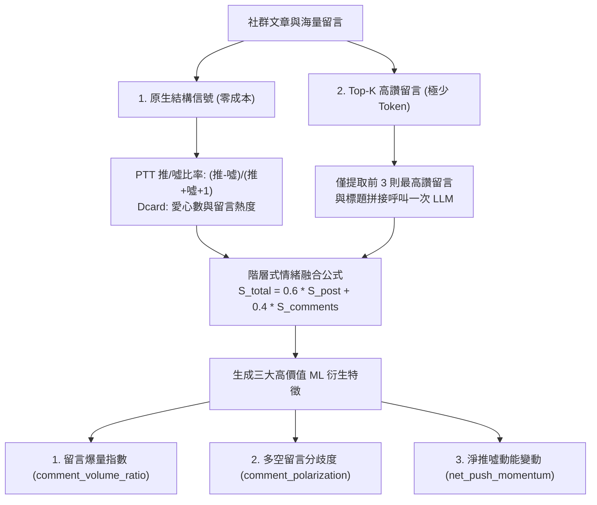

# MULTI_SOURCE_SENTIMENT_AND_COMMENT_FEATURE_SPEC.md — 多來源社群輿情與留言特徵化規格書

> **文件定位**：本文件依據 Project Owner 需求，定義系統擴展 **Dcard（股票/理財板）** 與 **Threads（即時熱門話題）** 多來源社群輿情架構，以及將**海量留言（Comments / Replies）以低成本、高效能轉化為機器學習特徵值**之演算法與資料規格。

---

## 1. 多社群來源價值定位與架構 (Multi-Source Sentiment Architecture)

```text
┌───────────────┬──────────────────────────────────┬─────────────────────────────────┬─────────────────────────────────┐
│ 社群平台      │ 使用者族群與輿情特性             │ 金融預測價值 (Alpha Value)      │ 爬取技術可行性                  │
├───────────────┼──────────────────────────────────┼─────────────────────────────────┼─────────────────────────────────┤
│ **PTT 股板**  │ 資深散戶、短線當沖客、籌碼技術派 │ 討論密度最高，多空情緒極端      │ ★★★☆☆ (需處理滿 18 歲 Cookie)  │
├───────────────┼──────────────────────────────────┼─────────────────────────────────┼─────────────────────────────────┤
│ **Dcard 股票**│ 年輕首投族、小資族、ETF 與概念股 │ 捕捉新興題材（如高股息、AI概念）│ ★★★★★ (有公開乾淨 REST API)     │
├───────────────┼──────────────────────────────────┼─────────────────────────────────┼─────────────────────────────────┤
│ **Threads**   │ 即時短文、KOL 觀點、情緒擴散極快 │ 具極高時間解析度，預警突發利多/空│ ★★★★☆ (Meta 官方 API / 搜尋串文)│
└───────────────┴──────────────────────────────────┴─────────────────────────────────┴─────────────────────────────────┘
```

### 1.1 平台特性與互補性
1. **PTT Stock 板**：台灣最大的資深散戶群體，情緒反應極具張力，適合捕捉短線情緒過熱（Overheating）與恐慌性拋售（Panic Selling）。
2. **Dcard 股票板 / 理財板**：代表 20~35 歲新興世代投資者，討論重心高度聚焦於熱門 ETF（如 0050, 0056, 00878）、高股息與科技趨勢概念股，具備強大的長線資金聚集效應。技術上擁有公開 REST API（`https://www.dcard.tw/service/api/v2/forums/stock/posts`），取得成本極低。
3. **Threads 趨勢串文**：演算法傳播極快，突發性新聞（如法說會亮點、美股盤後暴動）通常最先在 Threads 發酵，適合作為「AI 熱門題材即時探索」與「盤中情緒突波預警」。

---

## 2. 跨平台統一資料契約 (Unified Cross-Platform Data Contract)

所有平台抓取之文章與討論，均統一封裝為 `market_articles` 標準結構，**100% 相容現有 PostgreSQL 資料庫架構**：

```json
{
  "article_id": "dcard_258910234",          // 唯一前綴識別碼 (ptt_ / dcard_ / threads_)
  "source": "dcard_stock",                  // 來源平台: "ptt_stock" | "dcard_stock" | "threads"
  "fetch_keyword": "台積電",                // 關聯關鍵字或概念股代碼
  "post_time": "2026-08-21 14:35:00",       // 統一轉換為 UTC+8 ISO 時間
  "title": "台積電 8 月營收創歷史新高，下半年展望...",
  "content_excerpt": "今天看到法說會數據真的太狂了，資本支出直接拉高...", // 前 200 字摘要
  "url": "https://www.dcard.tw/f/stock/p/258910234",
  "author": "小資存股族",
  "engagement_metric": 158,                 // 統一互動指數 (PTT: 推噓差 | Dcard: 愛心數 | Threads: 按讚+轉發)
  "sentiment_score": 0.82                   // 融合留言後的綜合情緒分數 (0.0 ~ 1.0)
}
```

---

## 3. 海量留言轉化為 ML 特徵值之演算法 (Comment-to-Feature Engine)



### 3.1 痛點與解決方案對策
* **痛點**：若 100 篇文章各有 100 條留言（共 10,000 條），逐條呼叫 LLM 會導致 API 費用與時間爆炸。
* **對策一：原生推噓結構信號（零 API 成本）**
  * PTT 的 `推` (+1)、`噓` (-1)、`→` (0) 天生具備弱標籤（Weak Labels）。
  * 計算**「鄉民推噓共識率（Push Consensus Ratio）」**：
    $$\text{Push Ratio} = \frac{N_{\text{推}} - N_{\text{噓}}}{N_{\text{推}} + N_{\text{噓}} + 1} \in [-1.0, +1.0]$$
* **對策二：標題 + Top-K 留言拼接（單次 API 呼叫）**
  * 爬蟲在抓取文章時，**只擷取按讚數最高的前 3 則留言**，拼接入單一 Prompt：
    > *「文章標題：【新聞】台積電營收爆發。熱門留言 1：噴噴噴、熱門留言 2：外資今天大買、熱門留言 3：小心短線拉高出貨。請綜合評估整體多空分數。」*
  * **效益**：API 呼叫次數維持 **1 次**，卻能同時捕捉主文觀點與受眾群體反饋。

---

### 3.2 留言轉化為 3 大金融機器學習衍生特徵

| 留言衍生特徵 | 數學定義與公式 | 金融行為學意義與預測價值 |
| :--- | :--- | :--- |
| **`comment_volume_ratio`**<br>(留言熱度衝擊) | $\frac{\text{當日總留言數}}{\text{過去 5 日平均留言數} + 1}$ | **散戶注意力激增（Attention Surge）**：<br>學術證實（Da et al., 2011, *Journal of Finance*）散戶注意力突增是短期股價暴動或反轉的顯著領先指標。 |
| **`comment_polarization`**<br>(留言多空分歧度) | $1 - \left(\frac{N_{\text{推}} - N_{\text{噓}}}{N_{\text{推}} + N_{\text{噓}} + 1}\right)^2$ | **市場多空激烈對決（Disagreement / Dispersion）**：<br>當推與噓接近 1:1 時分歧度達 1.0，學術證實高分歧度能直接預測**次日股價高波動率（Volatility Spike）**！ |
| **`net_push_momentum`**<br>(淨推噓動能) | $\text{Push Ratio}_t - \text{Push Ratio}_{t-1}$ | **情緒加速度（Sentiment Acceleration）**：<br>捕捉社群風向由空翻多或由多翻空的轉折點。 |

---

## 4. 系統落地路徑規劃 (Implementation Roadmap)

1. **第一步（先導）**：在現有 PTT 爬蟲中，優先提取推噓文結構數據，在 `feature_aggregator.py` 實作 `comment_volume_ratio` 與 `comment_polarization` 注入 18 欄位特徵矩陣。
2. **第二步（擴展）**：新增 `src/extractors/dcard_scraper.py`，調用 Dcard 股票板 REST API 接入文章與 Top-3 留言。
3. **第三步（探索）**：新增 `src/extractors/threads_scraper.py`，專門服務 `trend_discover.py` AI 題材探索模組。
